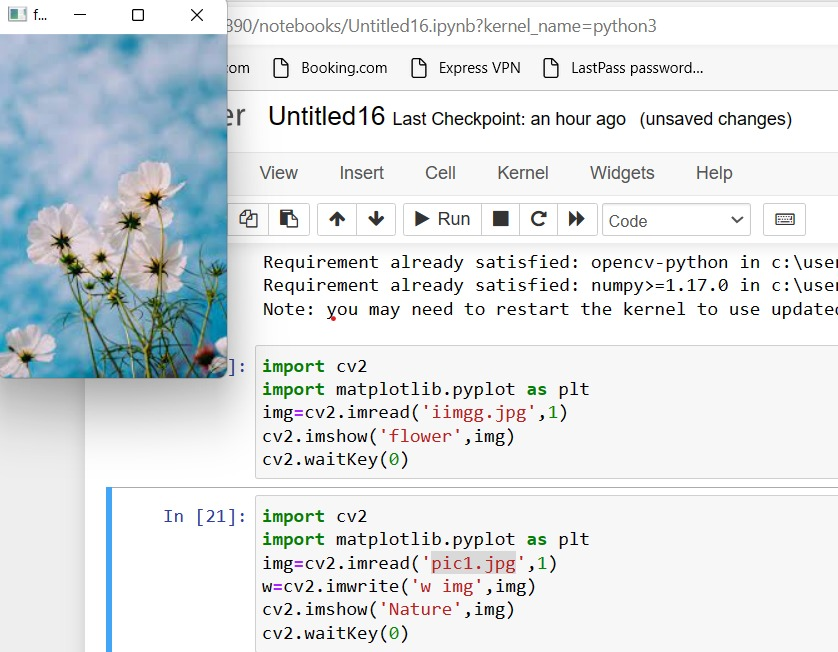
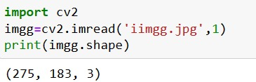
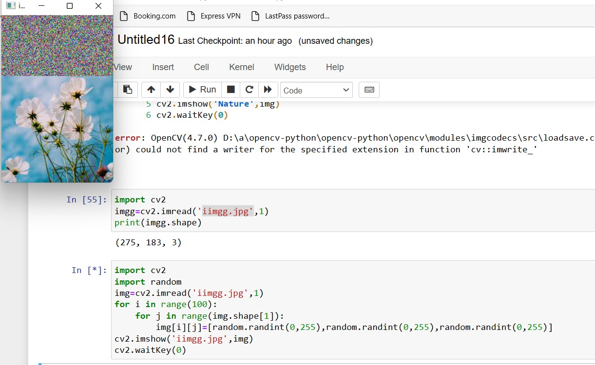
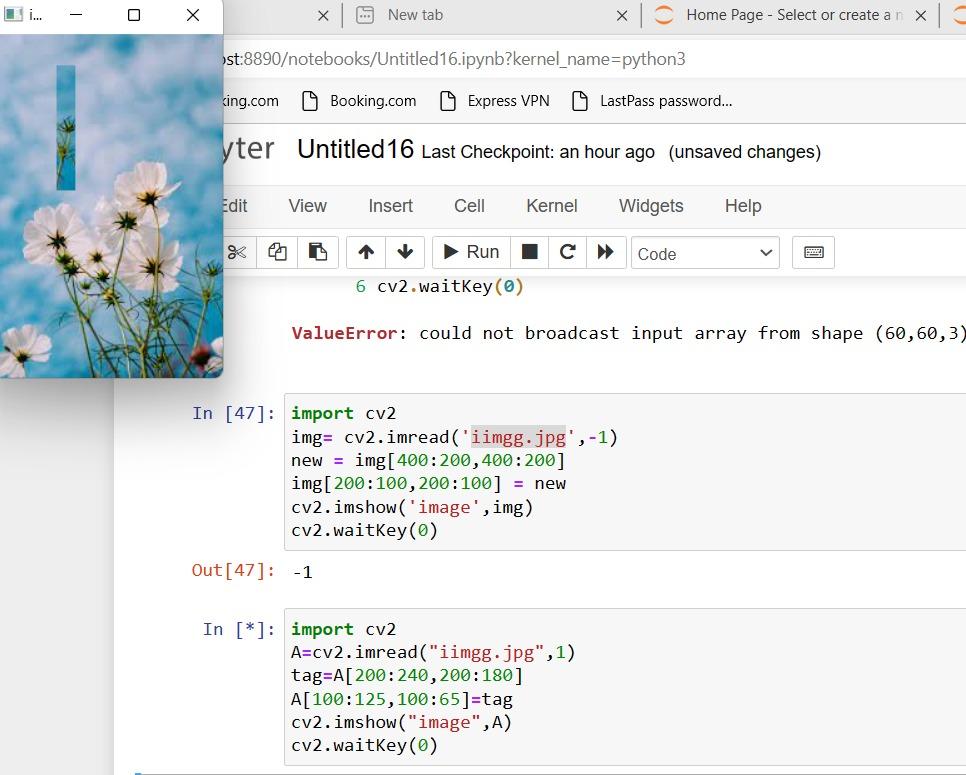

# READ AND WRITE AN IMAGE
## AIM
To write a python program using OpenCV to do the following image manipulations.
i) Read, display, and write an image.
ii) Access the rows and columns in an image.
iii) Cut and paste a small portion of the image.

## Software Required:
Anaconda - Python 3.7
## Algorithm:
### Step1:
Choose an image and save it as a filename.jpg
### Step2:
Use imread(filename, flags) to read the file.
### Step3:
Use imshow(window_name, image) to display the image.
### Step4:
Use imwrite(filename, image) to write the image.
### Step5:
End the program and close the output image windows.
## Program:
### Developed By: Shobika P
### Register Number: 212221230096
i) #To Read,display the image
```
 import cv2
import matplotlib.pyplot as plt
img=cv2.imread('iimgg.jpg',1)
cv2.imshow('flower',img)
cv2.waitKey(0)
 

```
ii) #To write the image
```
 import cv2
image=cv2.imread('iimgg.jpg',1)
w=cv2.imwrite('flower',image)
cv2.cv2.imshow('iimgg.jpg',1)
cv2.waitKey(0)


```
iii) #Find the shape of the Image
```
import cv2
imgg=cv2.imread('iimgg.jpg',1)
print(imgg.shape)


```
iv) #To access rows and columns

```
import random
import cv2
A=cv2.imread("iimgg.jpg",1)
for i in range(100):
    for j in range(A.shape[1]):
        A[i][j]=[random.randint(0,255),random.randint(0,255),random.randint(0,255)]
cv2.imshow("iimgg.jpg",A)
cv2.waitKey(0)


```
v) #To cut and paste portion of image
```
import cv2
img= cv2.imread('iimgg.jpg',-1)
new = img[400:200,400:200]
img[200:100,200:100] = new
cv2.imshow('image',img)
cv2.waitKey(0)


```

## Output:

### i) Read and display the image




### ii)Write the image


### iii)Shape of the Image



### iv)Access rows and columns


### v)Cut and paste portion of image


## Result:
Thus the images are read, displayed, and written successfully using the python program.


